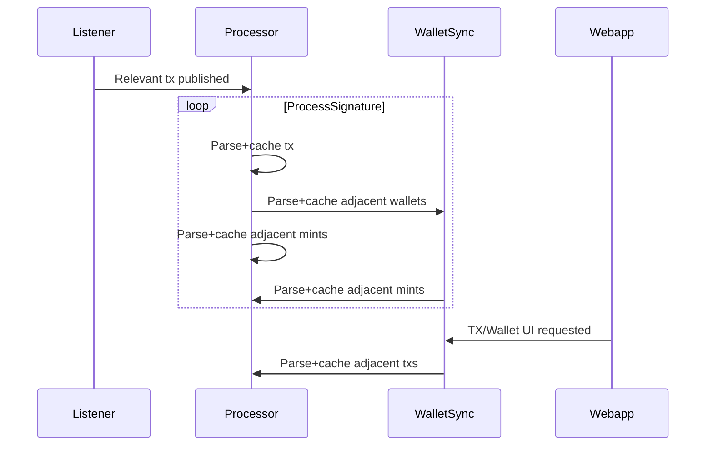

# Backend for [Carmel](https://carmel.vercel.app)

## Architecture Overview

The backend is designed to be infinitely scalable – limited only by GCP credits :)

The Listener module observes all NFT-related contracts on Solana and publishes a Pub/Sub message for each relevant event.

The Processor module is hosted as a Cloud Run instance. This way it scales relative to on-chain activity. It currently processes 50-70 tx/sec, which accounts for all NFT activity on-chain.

The WalletSync module listens for Pub/Sub messages which are sent by the frontend if an end-user requests any information not already cached in the Firestore DB.

###

Docker images are setup for each of the three components in [/docker](/docker). A GCP project is required to use the Pub/Sub and Firestore functionality (place Google Application Credentials json file in `./private/gcloud-credentials.json`
